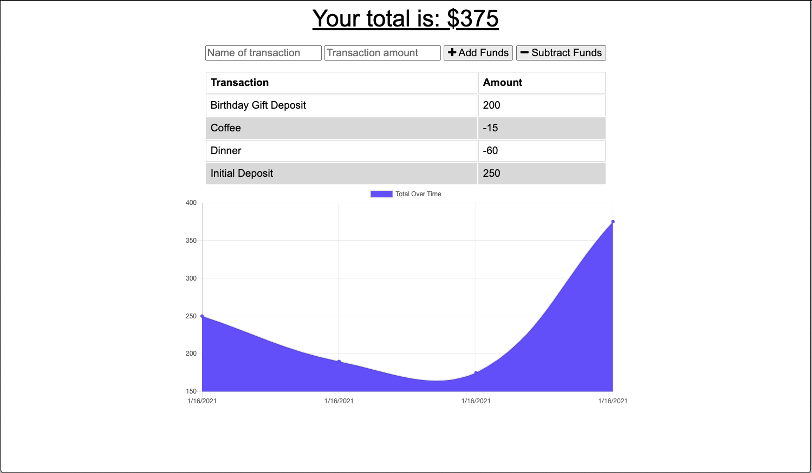

# budget-app

## Summary
In this assignment, we were tasked with building a Budget Progressive Web App that tracks deposits and withdrawals. Each transaction is logged using Mongo Atlas. In the event that the browser is offline, transactions can still be added and they are stored using IndexedDb.

## Instruction

Navigate to the following Github repository:
    https://github.com/hsaddanathan/budget-app.git

Across the top of the page, click on the Fork button on the right.

Once you have done this, you will see the repo copied within your Github account

Click the Green "Code" Button, and copy repo link. 

Open Terminal and run "git clone (Paste Link Here)"

Once repo has been cloned, you can run " code ." to open in Visual Studio Code. 

From there, open your terminal inside VS Code by using the keyboard shortcut "Ctrl + `. 

Next, type "npm install" to install dependencies.

Once you have done this, type "node server.js".

Then, you can navigate to http://localhost:3000. 

Alternatively, you can navigate to https://desolate-savannah-04120.herokuapp.com/ and run the program from there.

## Technology Used
    * node.js
    * Javascript
    * Mongoose/ MongoDB / Mongo Atlas
    * Robo 3T
    * Express
    * IndexedDB
    * Heroku
## Demo

## Links

Budget App Heroku URL:
    https://desolate-savannah-04120.herokuapp.com/

Budget App GitHub Repo:
    https://github.com/hsaddanathan/budget-app.git

## Contributors 
[@hsaddanathan](https://github.com/hsaddanathan)

## License
